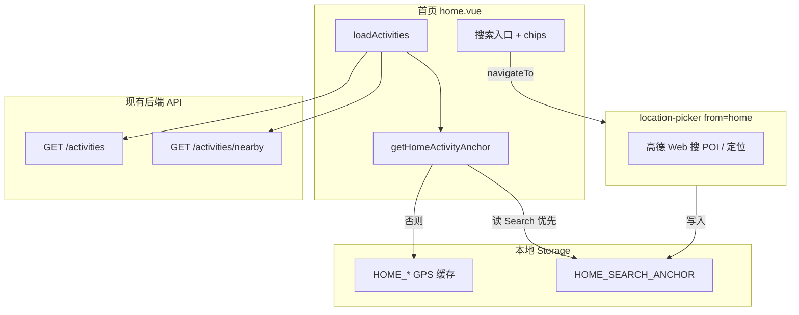
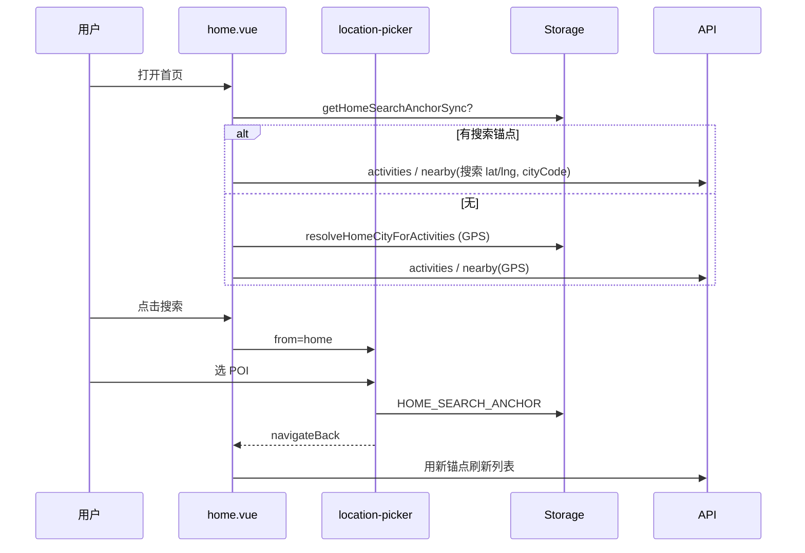

# 旅聚 WanderMeet — 首页搜地点（技术方案 v0.1）

> **产品依据**：`PRD_WanderMeet_首页搜地点_v0.1.md`  
> **仓库**：后端 `wander_meet`；前端 `lv_ju/travel-together`（兄弟目录）  
> **结论**：**后端 v0.1 无需新接口**；改造集中在前端首页与选点页参数化。

---

## 1. 架构概览



---

## 2. 后端方案

### 2.1 是否需要新接口

**不需要。** 现有接口已支持首页所需参数：

| 场景 | 接口 | 关键 query |
|------|------|------------|
| 今天 / 明天 / 全部 | `GET /api/v1/wm/activities` | `cityCode`, `dateRange`, 可选 `lat`, `lng`（卡片距离） |
| 距离优先 | `GET /api/v1/wm/activities/nearby` | `lat`, `lng`, `radiusKm`, `cityCode`, `sortBy=distance` |

实现参考：`doc/API_WanderMeet_v0.1.md` §10、§37；缓存见 `doc/PERF_Cache_and_Scale.md`（按 `cityCode` / 坐标 key 失效，对首页无特殊处理）。

### 2.2 后端职责（v0.1）

| 项 | 说明 |
|----|------|
| 接口契约 | **不变**；前端传搜索锚点的 `cityCode` + `lat/lng` 即可 |
| `cityCode` 规则 | 继续由前端 `adcodeToListCityCode` 统一（与 `homeCity.js` 一致） |
| 区县扩展 | 保持 `GET /activities` 现有「同城含区县」查询逻辑 |
| 坐标系 | 文档写 WGS84/GCJ-02 混用处与线上一致；前端统一 **GCJ-02**（与选点、高德一致） |

### 2.3 可选优化（非 v0.1 阻塞）

| 优化 | 说明 |
|------|------|
| 列表带 `lat/lng` | 今天/明天请求附带锚点坐标，卡片 `distanceMeters` 相对搜索点展示（若当前未传） |
| 监控 | 无需区分搜索/GPS；按现有活动列表 QPS 即可 |

### 2.4 后端改动清单

- [ ] **无代码改动**（默认）
- [ ] （可选）在 `API_WanderMeet_v0.1.md` §10 补充一句：首页搜索锚点通过 `cityCode` + `lat/lng` 传入

---

## 3. 前端方案

### 3.1 模块划分

| 文件 / 模块 | 改动 |
|-------------|------|
| `src/utils/homeCity.js` | 新增搜索锚点读写、`getHomeActivityAnchor()`、`clearHomeSearchAnchor()` |
| `src/pages/home/home.vue` | 搜索入口 UI；`ensureHomeCity` → `ensureActivityAnchor`；`loadActivities` 用锚点 |
| `src/pages/location-picker/location-picker.vue` | 支持 `from=home`；回写 `HOME_SEARCH_ANCHOR` 而非 `PUBLISH_*` |
| `src/pages.json` | 无新路由（复用 `location-picker`） |

### 3.2 Storage 契约

```javascript
// 新增 — 仅首页列表用
export const HOME_SEARCH_ANCHOR_KEY = 'HOME_SEARCH_ANCHOR'

/**
 * @typedef {Object} HomeSearchAnchor
 * @property {number} lat
 * @property {number} lng
 * @property {string} cityCode  // list 用地级市码
 * @property {string} displayName // 副标题/搜索栏展示
 * @property {string} [address]
 * @property {number} [updatedAt] // Date.now()，可选
 */

// 保留 — GPS，不被搜索覆盖
// HOME_USER_LOCATION, HOME_CITY_CODE, HOME_CITY_NAME
```

**`getHomeActivityAnchor()`**（同步 + 异步组合）：

```javascript
export function getHomeSearchAnchorSync() {
  const raw = uni.getStorageSync(HOME_SEARCH_ANCHOR_KEY)
  if (!raw?.lat || !raw?.lng || !raw?.cityCode) return null
  return { ...raw, lat: Number(raw.lat), lng: Number(raw.lng) }
}

export async function getHomeActivityAnchor() {
  const search = getHomeSearchAnchorSync()
  if (search) return { source: 'search', ...search }
  const gps = await resolveHomeCityForActivities()
  return { source: 'gps', displayName: gps.cityName, ...gps }
}

export function clearHomeSearchAnchor() {
  uni.removeStorageSync(HOME_SEARCH_ANCHOR_KEY)
}
```

### 3.3 `location-picker` 参数化

**路由**：`/pages/location-picker/location-picker?from=home`

| `from` | 确认选点写入 | 返回后 |
|--------|--------------|--------|
| 缺省 / `publish` | `PUBLISH_LOCATION_PICK_RESULT`（现状） | 发布页 `onShow` 读取 |
| `home` | `HOME_SEARCH_ANCHOR`（含 `displayName`, `cityCode` 用 `adcodeToListCityCode`） | 首页 `onShow` 刷新 |

**`onChoose(item)` 伪代码**：

```javascript
const lng = ...
const lat = ...
const cityCode = adcodeToListCityCode(item.adcode)
const payload = {
  lat, lng, cityCode,
  displayName: item.name || item.district || '',
  address: item.address || '',
  updatedAt: Date.now(),
}
if (this.from === 'home') {
  uni.setStorageSync(HOME_SEARCH_ANCHOR_KEY, payload)
} else {
  uni.setStorageSync('PUBLISH_LOCATION_PICK_RESULT', { ... })
}
uni.navigateBack()
```

**`from=home` 时「使用我的位置」**：

1. `clearHomeSearchAnchor()`
2. `resolveHomeCityForActivities()` 刷新 GPS 缓存
3. `navigateBack()`（首页 `onShow` 拉列表）

### 3.4 `home.vue` 改造要点

**data**

```javascript
activityAnchor: null,  // getHomeActivityAnchor 结果
hasSearchAnchor: false,
```

**computed `citySubtitle`**

```javascript
const name = this.activityAnchor?.displayName
  || this.activityAnchor?.cityName
  || '定位中'
return `${name} · 今天就能找到人`
```

**搜索栏**

```javascript
onTapSearch() {
  uni.navigateTo({ url: '/pages/location-picker/location-picker?from=home' })
}
onClearSearch() {
  clearHomeSearchAnchor()
  this.refreshAnchorAndList()
}
```

**`loadActivities`**

```javascript
const anchor = await getHomeActivityAnchor()
this.activityAnchor = anchor
this.hasSearchAnchor = anchor.source === 'search'
const { lat, lng, cityCode } = anchor

if (this.activeChip === 'nearby') {
  await getNearbyActivities({ lat, lng, cityCode, radiusKm: 5, dateRange: 'all', sortBy: 'distance', ... })
} else {
  await getActivities({ cityCode, dateRange, lat, lng, ... })  // 建议带上 lat/lng 便于距离展示
}
```

**生命周期**

- `onShow`：先 `getHomeSearchAnchorSync()` 更新 UI，再 `loadActivities()`（从选点页返回必刷新）。

### 3.5 UI 样式

- 搜索行复用 `$wm-card-edge`、`$wm-radius-lg`，与 `location-picker` 搜索条视觉一致。
- 已搜索态：左侧地点名 + 右侧「×」清除，避免占满副标题行。

### 3.6 前端改动清单

| # | 任务 | 文件 |
|---|------|------|
| 1 | 搜索锚点工具函数 | `utils/homeCity.js` |
| 2 | 首页搜索入口 + 清除 | `pages/home/home.vue` |
| 3 | `from=home` 分支 | `pages/location-picker/location-picker.vue` |
| 4 | （可选）`getActivities` 传 `lat/lng` | `home.vue` + 确认 `wandermeet.js` 已支持 query |
| 5 | 自测用例见 §5 | — |

### 3.7 与 Mock

- `getMockEnabled()` 时：`resolveHomeCityForActivities` 仍用 FALLBACK/缓存；搜索锚点逻辑 **同样生效**，便于 UI 联调。

---

## 4. 数据流（时序）



---

## 5. 测试计划

| # | 用例 | 预期 |
|---|------|------|
| 1 | GPS 在北京，搜「枣庄」选 POI，chip=今天 | 列表为枣庄 `cityCode` 活动，非北京 |
| 2 | 同上，chip=距离优先 | 以 POI 为中心 5km，距离递增 |
| 3 | 清除搜索 | 副标题回 GPS 城市，列表回 GPS |
| 4 | 选点页「使用我的位置」from=home | 清搜索锚点，列表回 GPS |
| 5 | 发布页选点 | 仍只写 `PUBLISH_LOCATION_PICK_RESULT`，首页锚点不变 |
| 6 | 杀进程重进 | 搜索锚点仍生效（Storage） |
| 7 | 发现页搜地点 | 行为与改前一致 |

---

## 6. 风险与依赖

| 风险 | 缓解 |
|------|------|
| 高德 Web Key 配额/域名校验 | 与发布选点共用 key；小程序 request 合法域名含 `restapi.amap.com` |
| POI `adcode` 为空 | 选点后对 `previewLat/lng` 再 `fetchRegeo` 补全（可复用 picker 现有逻辑） |
| 跨城搜索后 today 无活动 | 空态提示（PRD 可后置） |

---

## 7. 实施顺序（建议）

1. `homeCity.js`：锚点 API + 单测/手测 Storage  
2. `location-picker`：`from=home` 写回  
3. `home.vue`：入口 + `loadActivities` 改造  
4. 联调跨城 + 距离优先  
5. 更新 `Prototype_WanderMeet_v0.1.md` 首页线框（可选）

---

文档版本：v0.1  
更新日期：2026-05-20
