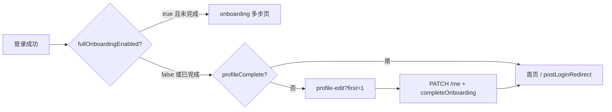

# WanderMeet 新手引导 — 产品与实现进度

更新时间：**2026-05-20**  
适用范围：小程序 `lv_ju/travel-together` + 后端 `wander_meet`

---

## 1. 产品决策（当前阶段）

| 项 | 结论 |
|----|------|
| 首次登录门槛 | **1 屏**：昵称 + 性别（男/女）+ 出生日期（必填），保存后进入首页 |
| 昵称规则 | 用户自填；系统默认 `旅人xxxx`（微信/短信登录分配）**不算完成** |
| 性别规则 | 仅 **男 / 女**；首次提交后不可修改；**不提供「保密」** |
| 出生日期 | 年+月+日；选择器默认 **今天减 18 年** |
| 完整多步引导（约 13 步） | **暂时关闭**，代码保留 `pages/onboarding/onboarding` |
| 渠道、国家、城市、兴趣等 | **首次不收集**；用户在「我的 → 编辑资料」自愿补充 |

---

## 2. 用户路径（已实现目标）

**默认**：`fullOnboardingEnabled = false` → 新用户走 **E**，不走 **C**。

**拦截点**：静默登录、登录页 onShow、首页 onShow、完善页禁止返回（`first=1`）。

---

## 3. 实现进度

### 3.1 后端（wander_meet）

| 能力 | 状态 | 说明 |
|------|------|------|
| `users.birth_date` | ✅ | 迁移 `20260614_0031` |
| `GET /me` → `birthDate`, `profileComplete` | ✅ | `profileComplete` 服务端计算 |
| `PATCH /me` → `birthDate` | ✅ | ISO 日期 `YYYY-MM-DD` |
| `completeOnboarding` 校验 | ✅ | 昵称非默认、性别男/女、出生日期必填 |
| 登录响应 `LoginUser` | ✅ | 含 `birthDate`, `profileComplete` |
| `GET /meta/onboarding` | ✅ | 词表 + `fullOnboardingEnabled` |

### 3.2 小程序（travel-together）

| 能力 | 状态 | 说明 |
|------|------|------|
| `profile-edit?first=1` | ✅ | 昵称 + 性别 + 出生日期 |
| `navigateAfterLogin` / `profileGate` | ✅ | 读 `profileComplete` |
| 静默登录 / App 启动 | ✅ | 资料未完善则跳转完善页 |
| 登录页已有 token | ✅ | `getMe` + `navigateAfterLogin`，不再直跳首页 |
| 首页 onShow | ✅ | `redirectIfProfileIncomplete` |
| Mock API | ✅ | 对齐 `birthDate` / `profileComplete` |

---

## 4. 运维

1. 服务器执行 `alembic upgrade head`（含 `20260614_0031`）
2. 重启 `wandermeet`
3. 小程序重新编译发版

恢复完整多步引导：`.env` 设 `ONBOARDING_FULL_ENABLED=true` 并重启。

---

## 5. 自测清单

1. 新号微信/短信登录 → 进入 **完善资料**（昵称、性别、出生日期）。
2. 系统昵称 `旅人xxxx` 不可保存；性别无「保密」；出生日期默认 18 年前。
3. `first=1` 时无法返回跳过；保存后 `GET /me` 含 `profileComplete: true`。
4. 再次打开小程序（有 token）→ 资料完整则进首页，否则仍进完善页。
5. 已保存性别不可在编辑页修改。

---

## 6. 关联文档

- `doc/WanderMeet_Nomadtable_Onboarding_对照.md`
- `doc/TODO_Backend_NextSteps.md` §5
- `.cursor/rules/wandermeet-auth-and-miniapp.mdc`
