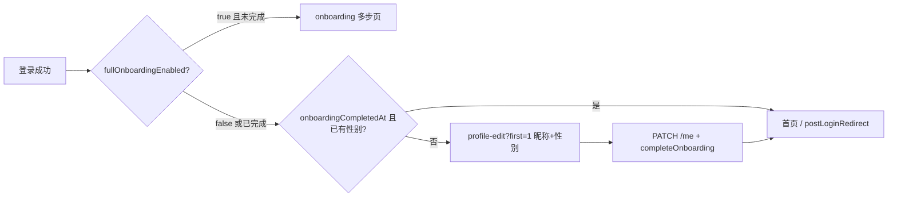

# WanderMeet 新手引导 — 产品与实现进度

更新时间：**2026-05-20**  
适用范围：小程序 `lv_ju/travel-together` + 后端 `wander_meet`

---

## 1. 产品决策（当前阶段）

| 项 | 结论 |
|----|------|
| 首次登录门槛 | **1 屏**：昵称 + 性别（必填），保存后进入首页 |
| 完整多步引导（约 13 步） | **暂时关闭**，代码保留 `pages/onboarding/onboarding`，用户量/运营需要时可再开 |
| 渠道、国家、城市、兴趣、通知、定位说明等 | **首次不收集**；用户在 **「我的 → 编辑资料」** 自愿补充 |
| 性别规则 | 与现网一致：**首次提交后不可修改** |

与推广节奏一致：先进城群、先逛活动，降低首次登录摩擦；仍保证聊天/列表有基础展示名与性别规则。

---

## 2. 用户路径（已实现目标）

**默认（2026-05-20）**：`fullOnboardingEnabled = false` → 新用户走 **E**，不走 **C**。

---

## 3. 实现进度

### 3.1 后端（wander_meet）

| 能力 | 状态 | 说明 |
|------|------|------|
| `users.onboarding_completed_at` | ✅ | 完成极简引导时由 `PATCH /me` `completeOnboarding: true` 写入 |
| `PATCH /me` 昵称、性别、`completeOnboarding` | ✅ | 已有；性别锁定逻辑不变 |
| 引导扩展字段（国家、标签、停留等） | ✅ 落库 | 长引导或「编辑资料」扩展时使用，**非首次必填** |
| `GET /meta/onboarding` | ✅ | 词表 + **`fullOnboardingEnabled`**（读 `ONBOARDING_FULL_ENABLED`） |
| 环境变量 `ONBOARDING_FULL_ENABLED` | ✅ | 默认 `false`；设为 `true` 可恢复多步引导入口 |

### 3.2 小程序（travel-together）

| 能力 | 状态 | 说明 |
|------|------|------|
| 登录后跳转 `navigateAfterLogin` | ✅ | 读服务端/本地配置，默认极简引导 |
| `profile-edit?first=1` | ✅ | 仅昵称 + 性别；保存带 `completeOnboarding` |
| `pages/onboarding/onboarding` | 🔒 保留 | 未删除；`fullOnboardingEnabled=true` 时重新启用 |
| 「我的 → 编辑资料」 | ✅ 部分 | 昵称 / 性别 / 简介；国家、兴趣等仍待 UI 扩展 |
| App 启动预拉引导配置 | ✅ | `loadOnboardingConfig()` |

### 3.3 待办（非本次范围）

- [ ] 「编辑资料」补全国家、旅行身份、兴趣标签等（对齐长引导字段）
- [ ] 头像 OSS 直传 + 编辑页选图
- [ ] 按渠道/标签做推荐与运营报表（依赖字段有数据后）

---

## 4. 运维：如何恢复完整多步引导

1. 服务器 `.env`：`ONBOARDING_FULL_ENABLED=true`
2. 重启 `wandermeet` 服务
3. 小程序无需发版即可生效（启动时拉 `GET /meta/onboarding`）
4. **仅影响** `onboardingCompletedAt` 为空的新登录用户；已走完极简引导的用户不会再次进入

本地对照文档：`doc/WanderMeet_Nomadtable_Onboarding_对照.md`（全量步骤清单仍作排期参考）。

---

## 5. 自测清单

1. 新号短信/微信登录 → 进入 **完善资料**（仅昵称、性别），无 13 步分屏。
2. 保存后 Storage 有 token；`GET /me` 含 `onboardingCompletedAt`、性别、昵称。
3. 再次登录 → **直接首页**，不再进引导。
4. 「我的 → 编辑」可改昵称、简介；已选性别不可改。
5. 服务端 `ONBOARDING_FULL_ENABLED=true` 后，新号（未完成引导）进入 `onboarding` 多步页。

---

## 6. 关联文档

- `doc/WanderMeet_Nomadtable_Onboarding_对照.md` — 与 NomadTable 全量步骤对照
- `doc/TODO_Backend_NextSteps.md` §5 — 后端字段与 meta 历史待办
- `.cursor/rules/wandermeet-auth-and-miniapp.mdc` — 鉴权与小程序事实清单（可择机补充本决策）
