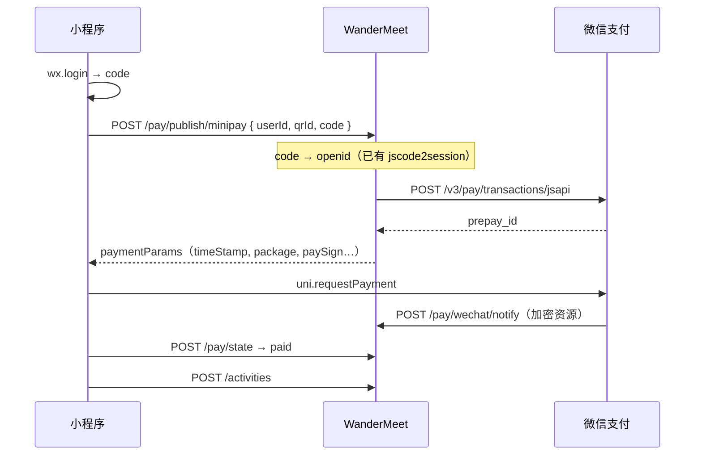
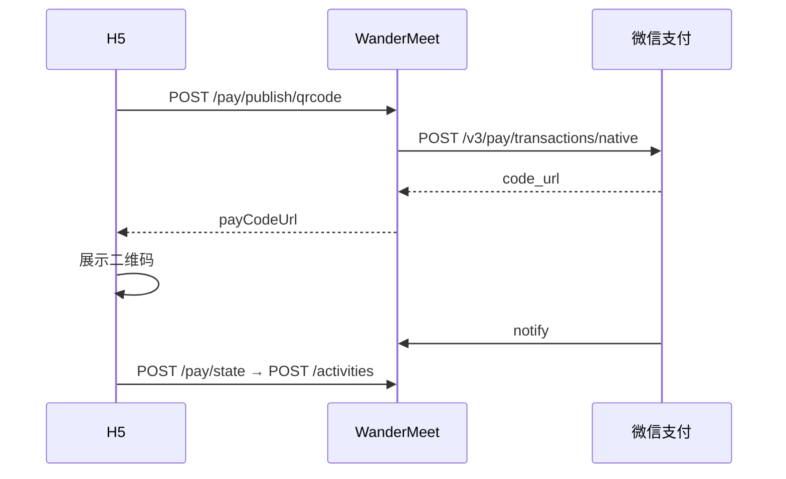

# WanderMeet 微信支付 — 方案与实施（官方直连）

> **当前代码**：仅实现 **YunGouOS**（[`doc/pay_api.md`](pay_api.md)）。  
> **目标**：上线 **微信官方 APIv3 直连**；YunGouOS **暂停进件、生产停用**（代码保留作历史/应急）。

业务不变：**发布活动前付 1 元**（`product=publish`）。  
策略 **A**：`POST /activities` 不校验是否已付费，由前端保证「先付后发布」。

---

## 0. 已确认决策（2026-05）

| # | 结论 |
|---|------|
| 1 | 小程序主体为 **企业** → 可申请官方微信支付商户号 |
| 2 | **H5 与小程序均收费**（见 §0.1） |
| 3 | **不改**对外 `/pay/publish/*`、`/pay/state` 路径；对内区分 **`wechat` / `yungou`**（见 §2.2） |
| 4 | 官方后端开发完成并联调通过后，生产 **`PAY_PROVIDER=wechat`，立即切换** |
| 5 | **YunGouOS 进件暂停**；不在生产启用 YunGouOS 收款 |

### 0.1 H5 + 小程序同时收费（可以，需开通两个产品）

| 端 | 用户场景 | 对外接口（不变） | 微信产品（商户平台开通） | 官方 API |
|----|----------|------------------|--------------------------|----------|
| **小程序** | 在小程序内点「发布」→ 调起微信支付 | `POST /pay/publish/minipay` | **JSAPI 支付**（含小程序支付） | `POST /v3/pay/transactions/jsapi` |
| **H5** | 手机浏览器打开 H5 → 展示付款二维码 → 微信扫一扫付款 | `POST /pay/publish/qrcode` | **Native 扫码支付** | `POST /v3/pay/transactions/native` |

说明：

- 旅聚 H5 发布页沿用 **扫码付**（`payCodeUrl` 生成二维码），**不需要**单独做「微信内 H5 网页支付」（那要 **H5 支付** 产品 + 公众号/开放平台，流程更重）。
- 两端共用：`POST /pay/state` 轮询、同一套 `wm_pay_orders`、同一商户号；仅下单与回调实现按通道区分。
- 运营在微信商户平台申请时，**JSAPI + Native 一并开通**；AppID 绑定小程序 `wx2c90affdff680665`。

---

## 0.2 方案对比（背景）

| 维度 | **A. 微信官方直连（首选）** | **B. YunGouOS 聚合（备选）** |
|------|---------------------------|------------------------------|
| 商户归属 | 你自己的微信支付商户号（MchID） | 经 YunGouOS 进件的特约/个人商户 |
| 资金清算 | 微信 → 你的结算银行卡 | 微信 → 你的卡（YunGouOS 不经手资金，但多一层平台） |
| 接口与文档 | [微信支付 APIv3](https://pay.weixin.qq.com/wiki/doc/apiv3/index.shtml) 官方 | YunGouOS 私有 API + MD5 签名 |
| 密钥 | APIv3 密钥 + 商户 API 证书（RSA） | YunGouOS「支付密钥」（非 v3） |
| 小程序支付 | **JSAPI / 小程序支付**（标准路径） | 调 YunGouOS `minAppPay` |
| H5 扫码 | **Native** 直连微信 | 调 YunGouOS `nativePay` |
| 主体要求 | 小程序 **企业 / 个体户等**（**个人主体不能开通支付**） | 支持 **个人** 进件（你正在填的表单） |
| 依赖与成本 | 无第三方平台；按微信费率 | 可能有一次性开户/平台服务费（以合同为准） |
| 代码状态 | **待开发** | **已实现**（`yungou_pay.py` 等） |
| 适用场景 | 有执照、长期运营、要对齐微信生态 | 暂无执照、要快上线验证、官方进件周期长 |

**团队结论**：企业主体 → **只做官方直连**；YunGouOS 代码保留但 **生产不用**（`PAY_PROVIDER=wechat`）。

---

## 一、微信官方直连 — 运营 / 资质（阻塞项）

### 1.1 前置条件（缺一不可）

| # | 事项 | 说明 |
|---|------|------|
| 1 | 小程序已认证 | 主体为 **企业**（已满足） |
| 2 | 微信支付商户号 | [pay.weixin.qq.com](https://pay.weixin.qq.com) 或 小程序后台 → **微信支付** → 新申请 |
| 3 | 资料 | 营业执照、法人身份证、结算账户、经营场景等（1～数个工作日） |
| 4 | AppID 绑定 | 商户平台 → **产品中心 → AppID 账号管理** → 绑定小程序 `wx2c90affdff680665` |
| 5 | 开通产品 | **JSAPI 支付**（小程序）+ **Native 扫码支付**（H5 二维码）；**不必**先开「H5 支付」产品（见 §0.1） |
| 6 | API 安全 | 设置 **APIv3 密钥**；申请并下载 **商户 API 证书**（含私钥，仅放服务器） |
| 7 | 回调 URL | 商户平台可配置支付通知 URL，或由下单接口 `notify_url` 指定（须 **HTTPS 公网**） |

### 1.2 YunGouOS

- **进件已暂停**；资料不继续提交，避免两套商户并行。  
- 官方商户 **账单展示名称** 进件时确定（审核通过后难改），建议 **`旅聚`**。

### 1.3 旅聚当前信息

| 项 | 值 |
|----|-----|
| 小程序 AppID | `wx2c90affdff680665`（`lv_ju/travel-together/src/manifest.json`） |
| 小程序名称 | 旅聚WanderMeet（以 mp 后台为准） |
| 后端 API 域名示例 | `https://www.wang-hao-hao.cn/api/v1/wm` |

---

## 二、微信官方直连 — 技术架构（建议）

### 2.1 支付通道抽象

**对外路径不变**（前端 H5 / 小程序共用同一套 URL）；**对内必须区分 `wechat` 与 `yungou`**：

| 层级 | 约定 |
|------|------|
| 环境变量 | `PAY_PROVIDER=wechat`（生产固定）；开发可 `mock` |
| 订单表 | `wm_pay_orders.pay_channel`：`wechat` \| `yungou`（新单官方一律 `wechat`） |
| 回调 URL | **分开**：`/pay/wechat/notify`（官方 JSON）与 `/pay/yungou/notify`（YunGouOS form，生产不挂流量） |
| 日志 / 监控 | 打点 `pay_channel`，便于排查混单 |

```env
# 生产（官方）
PAY_PROVIDER=wechat
WECHAT_PAY_MCH_ID=
WECHAT_PAY_API_V3_KEY=
WECHAT_PAY_CERT_SERIAL=
WECHAT_PAY_PRIVATE_KEY_PATH=   # 或 WECHAT_PAY_PRIVATE_KEY
WECHAT_MINIAPP_APP_ID=wx2c90affdff680665
WECHAT_PAY_NOTIFY_URL=https://www.wang-hao-hao.cn/api/v1/wm/pay/wechat/notify

# YunGouOS — 保留配置项，生产不启用
# PAY_PROVIDER=yungou
# YUNGOU_* 仅本地对照或历史订单回调
```

| 对外接口 | 官方实现 | YunGouOS（代码保留，生产停用） |
|----------|----------|-------------------------------|
| `POST /pay/publish/qrcode` | v3 **Native** → `code_url` → 响应仍叫 `payCodeUrl` | `nativePay` |
| `POST /pay/publish/minipay` | v3 **JSAPI** → `paymentParams` | `minAppPay` |
| `POST /pay/state` | 查库（按 `qr_id`，与 channel 无关） | 同左 |
| 回调 | `POST /pay/wechat/notify` | `POST /pay/yungou/notify` |

`state` 响应可选增加 `payChannel: "wechat"`（便于前端排错，非必须）。

### 2.2 官方 APIv3 核心流程

**小程序（主场景）**



**H5（若开通 Native）**



与 YunGouOS 差异：

- 签名：**RSA-SHA256**（Authorization 头），不是 MD5 `&key=`。  
- 回调：**JSON body**，`resource` 需用 APIv3 密钥 **AES-GCM 解密**。  
- 金额单位：**分**（integer），不是元字符串。  
- 推荐依赖：官方 [wechatpay-python](https://github.com/wechatpay-apiv3/wechatpay-python) 或自封装 httpx + 签名。

### 2.3 后端待开发清单（官方）

| # | 任务 | 说明 |
|---|------|------|
| 1 | `app/services/wechat_pay_v3.py` | 下单、查单、回调验签解密 |
| 2 | `PAY_PROVIDER` 分支 | `publish_pay.py` 内调用 wechat 或 yungou |
| 3 | `POST /pay/wechat/notify` | 返回 `{"code":"SUCCESS"}` 等 v3 规范 |
| 4 | minipay | `code` → openid（复用 `wechat_miniapp.code_to_session`），openid 必须与付款用户一致 |
| 5 | 配置与密钥管理 | 证书勿入库；`.env` + 文件权限；文档写清轮换方式 |
| 6 | Mock | `PAY_PROVIDER=mock` 或 `WECHAT_PAY_USE_MOCK=true` 本地联调 |
| 7 | 文档 | 更新 `pay_api.md` 增加官方回调字段说明 |

**可保留**：现有 YunGouOS 全套；`PAY_PROVIDER=yungou` 时行为与今天一致。

### 2.4 前端待办（与通道弱相关）

对外接口路径可不变；`paymentParams` 字段名与 `uni.requestPayment` 一致，官方与 YunGouOS 返回结构应对齐。

| # | 事项 |
|---|------|
| 1 | `publish.vue`：发布前走 pay，再 `createActivity`（当前仍直接发布） |
| 2 | 小程序：`wx.login` → `minipay` → `requestPayment` → 轮询 `state` |
| 3 | H5：若仅小程序先上线，H5 可暂隐藏付费或提示「请用小程序发布」 |
| 4 | `wandermeet.js` 封装 `createPublishPayQrcode` / `queryPublishPayState` / `createPublishMinipay` |
| 5 | 小程序后台 **request 合法域名** = API 域名 |

---

## 三、YunGouOS — 已冻结（代码保留）

- **进件：暂停**，不再提交 YunGouOS 资料。  
- **生产：`PAY_PROVIDER=wechat`**，上线官方后 **立即切换**，不走 YunGouOS 下单。  
- **代码**：`yungou_pay.py`、`/pay/yungou/notify` 保留，仅处理历史 `pay_channel=yungou` 订单或本地对照；**新功能只改 `wechat_pay_v3`**。  
- 接口说明见 [`doc/pay_api.md`](pay_api.md)（标注 YunGouOS 为遗留通道）。

---

## 四、分工总表（按首选官方重排）

| 角色 | 官方直连（主路径） | YunGouOS（备选） |
|------|-------------------|------------------|
| **运营** | 申请**官方**微信商户；绑 AppID；开通 **JSAPI + Native** | **暂停** YunGouOS |
| **运维** | `WECHAT_PAY_*`、证书、`/pay/wechat/notify` HTTPS | 不配 `YUNGOU_*` 生产 |
| **后端** | **待开发** `wechat_pay_v3` + `pay_channel` | 冻结维护 |
| **前端** | H5：`qrcode`；小程序：`minipay`；共用 `state` → `createActivity` | — |

---

## 五、实施顺序

```text
阶段 1  运营：企业主体下申请官方微信支付商户号；开通 JSAPI + Native；绑 AppID；APIv3 密钥 + 证书
阶段 2  后端：wechat_pay_v3；/pay/wechat/notify；wm_pay_orders.pay_channel；PAY_PROVIDER=wechat
阶段 3  前端：H5 publish → qrcode + state；小程序 publish → minipay + requestPayment + state
阶段 4  联调：H5 扫码付 + 小程序内付 → notify → state.paid → createActivity
阶段 5  上线：生产立即 PAY_PROVIDER=wechat；YunGouOS 不进件、不接新单
```

开发期本地可用 `WECHAT_PAY_USE_MOCK=true` 或 `PAY_PROVIDER=mock`；**不以 YunGouOS 作为生产过渡**。

---

## 六、已确认 — 技术细节

| 项 | 约定 |
|----|------|
| `out_trade_no` | 继续 `wm_pub_*` 前缀；新单 `pay_channel=wechat` |
| 对外路径 | 不改 `/pay/publish/qrcode`、`minipay`、`state` |
| 回调路径 | **区分**：`/pay/wechat/notify` vs `/pay/yungou/notify` |
| 切换 | 官方联调通过 → **立刻** `PAY_PROVIDER=wechat` |

---

## 七、常见问题

**Q：已有 YunGouOS 商户号，还要再申请微信商户吗？**  
A：走官方直连需要 **你自己** 在微信支付商户平台有 MchID；YunGouOS 下的号不等于你直连用的号（除非 YunGouOS 只是代进件且你后来把商户迁出，以合同为准，一般仍建议单独官方进件）。

**Q：APIv2 和 APIv3？**  
A：新项目 **只用 APIv3**；现有 YunGouOS 集成是另一套，与 v3 无关。

**Q：H5 和小程序都要收费，要申请几个微信产品？**  
A：**两个**：JSAPI（小程序 `minipay`）+ Native（H5 `qrcode`）。同一商户号、同一套 APIv3 配置即可。

**Q：后端还要改 YunGouOS 吗？**  
A：**不**。YunGouOS 冻结；新开发只在 `wechat_pay_v3`。

---

## 八、相关文件

| 类型 | 路径 |
|------|------|
| 本文（方案讨论） | `doc/wx_pay.md` |
| YunGouOS 接口约定 | `doc/pay_api.md` |
| YunGouOS 实现 | `app/services/yungou_pay.py`, `app/services/publish_pay.py` |
| 微信登录 / openid | `app/services/wechat_miniapp.py`, `auth/wechat/login` |
| 前端发布页 | `lv_ju/travel-together/src/pages/publish/publish.vue` |
